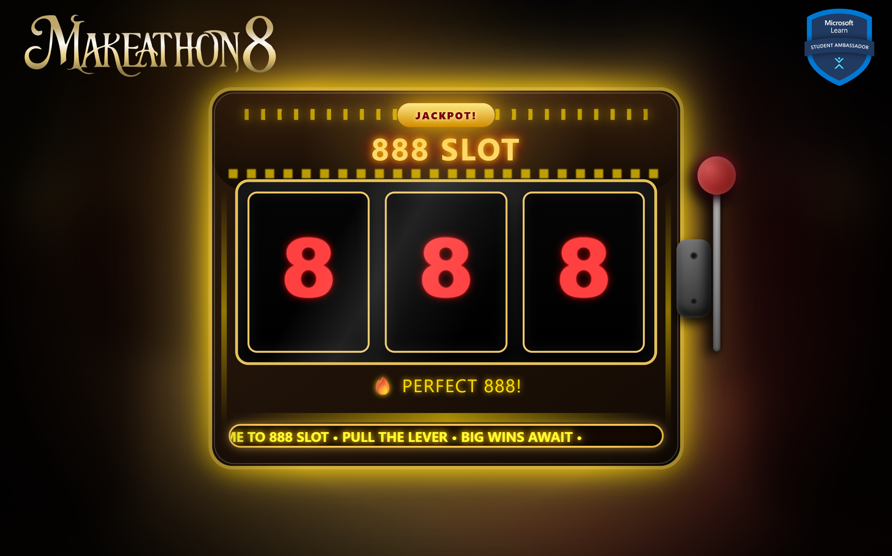
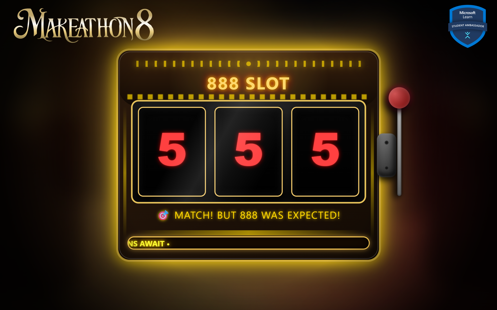
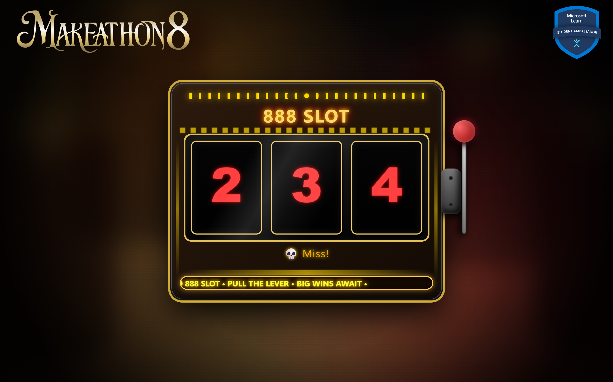

# 🎰 888 Slot Machine — Web Casino Simulation

> **Not just a luck game — a skill-influenced slot machine where timing, control, and precision matter.**

🎯 **Live Demo:** https://888-slot.netlify.app/

A cinematic, highly animated **web-based slot machine simulator** built using **HTML, CSS, and Vanilla JavaScript**.  
Designed to mimic a real casino cabinet with glowing lights, cabinet shake, lever mechanics, jackpot celebrations, and responsive auto-scaling for mobile devices.

---

## ✨ Features

| Category         | Description                                     |
| ---------------- | ----------------------------------------------- |
| 🎲 Reels         | Three animated vertical spinning reels          |
| 🎯 Win Detection | Perfect **888 Jackpot** + Triple-number matches |
| 🕹️ Interaction   | Lever pull + **keyboard-triggered spins**       |
| ⌨️ Keyboard      | Press **Enter** or **Spacebar** to spin/stop    |
| 💥 Effects       | Cabinet shake, neon glow, zoom burst            |
| 🎉 Jackpot       | Confetti blast + screen flash                   |
| 📺 Fullscreen    | Toggle using **F** key                          |
| 📱 Responsive    | Auto-scales for mobile & landscape              |
| 🌆 Background    | Animated casino skyline silhouettes             |
| 💡 UI            | LED marquee scrolling banner                    |
| ✨ Visuals       | Dynamic lighting, reflections & glow            |

---

## 📸 Preview

Open `index.html` in a browser to experience the full visual effect.

### Jackpot Celebration



### Just A Match



### Missed



---

## 🧠 How It Works

### 🎰 Reel System

- Each reel contains a repeating strip of numbers **(1–9)**
- Vertical scrolling driven by `requestAnimationFrame`
- Reels snap cleanly to the nearest symbol when stopping
- Visible values are analyzed for win conditions

### 🏆 Win Logic

| Result       | Outcome                             |
| ------------ | ----------------------------------- |
| **888**      | Jackpot animation + confetti + zoom |
| Triple Match | Glow animation                      |
| No Match     | Miss message                        |

### 📐 Auto Scaling

- Cabinet rescales based on viewport height
- Ensures full visibility in landscape mode
- Optimized for phones, tablets & desktops

---

## 🎮 Controls

| Action      | Method             |
| ----------- | ------------------ |
| Spin / Stop | Pull lever         |
| Spin / Stop | Press **Enter**    |
| Spin / Stop | Press **Spacebar** |
| Fullscreen  | Press **F**        |
| Resize      | Automatic          |

---

## 🛠 Tech Stack

- HTML5 — structure
- CSS3 — lighting, animation, effects, responsiveness
- JavaScript (ES6) — logic, physics, interaction

---

## 📂 Project Structure

```
/public
   ├─ mlsc.png
   ├─ makethon.png

index.html
style.css
script.js
README.md
```

---

## 🚀 Running Locally

No build tools required.

### 1️⃣ Clone the repository

```
git clone https://github.com/ViralJain758/888-Slot.git
```

### 2️⃣ Open the folder

```
cd 888-slot-machine
```

### 3️⃣ Run

Open `index.html` directly  
**or** use VS Code Live Server.

---

## 👤 Author

**Viral Jain**  
Engineering Student & Software Developer

---

## ⭐ If You Like This Project

Give it a star ⭐ — it helps visibility and motivates future improvements!

---

🔥 _A casino cabinet in your browser — built entirely with frontend magic._
